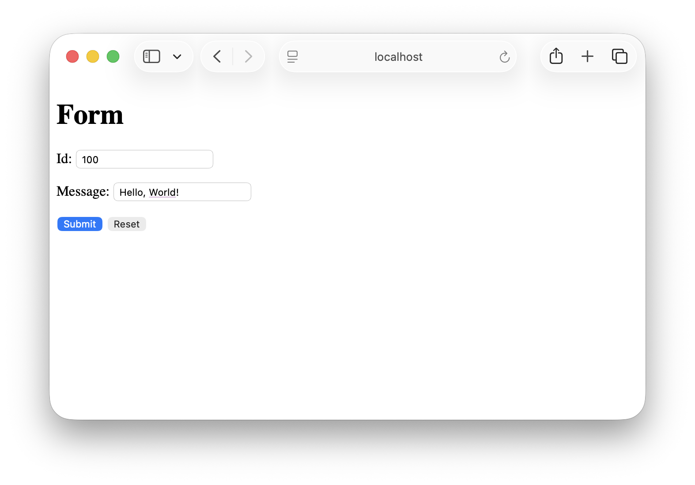
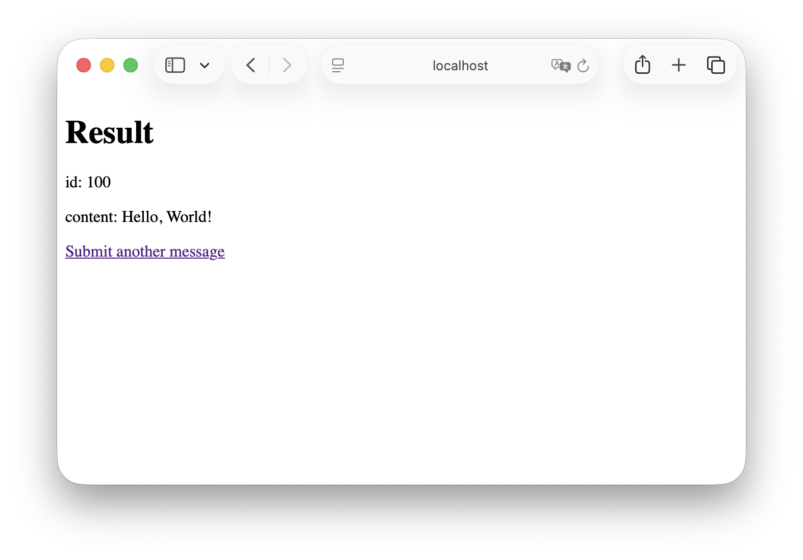

:spring_version: current
:spring_boot_version: 1.5.10.RELEASE
:Controller: http://docs.spring.io/spring/docs/{spring_version}/javadoc-api/org/springframework/stereotype/Controller.html
:DispatcherServlet: http://docs.spring.io/spring/docs/{spring_version}/javadoc-api/org/springframework/web/servlet/DispatcherServlet.html
:SpringApplication: http://docs.spring.io/spring-boot/docs/{spring_boot_version}/api/org/springframework/boot/SpringApplication.html
:View: http://docs.spring.io/spring/docs/{spring_version}/javadoc-api/org/springframework/web/servlet/View.html
:Model: http://docs.spring.io/spring/docs/{spring_version}/javadoc-api/org/springframework/ui/Model.html
:toc:
:icons: font
:source-highlighter: prettify
:project_id: gs-handling-form-submission
This guide walks you through the process of using Spring to create and submit a web form.

== What you'll build

In this guide, you will build a web form which will be accessible at the following URL:

    http://localhost:8080/greeting

Viewing this page in a browser will display the form. You can submit a greeting by populating the `id` and `content` form fields. A results page will be displayed when the form is submitted.

== What you'll need

:java_version: 1.8
include::https://raw.githubusercontent.com/spring-guides/getting-started-macros/master/prereq_editor_jdk_buildtools.adoc[]

include::https://raw.githubusercontent.com/spring-guides/getting-started-macros/master/how_to_complete_this_guide.adoc[]

include::https://raw.githubusercontent.com/spring-guides/getting-started-macros/master/hide-show-gradle.adoc[]

include::https://raw.githubusercontent.com/spring-guides/getting-started-macros/master/hide-show-maven.adoc[]

include::https://raw.githubusercontent.com/spring-guides/getting-started-macros/master/hide-show-sts.adoc[]

[[initial]]
== Create a web controller

In Spring's approach to building web sites, HTTP requests are handled by a controller. These components are easily identified by the {Controller}[`@Controller`] annotation. The GreetingController below handles GET requests for /greeting by returning the name of a {View}[`View`], in this case, "greeting". A `View` is responsible for rendering the HTML content:

`src/main/java/hello/GreetingController.java`
[source,java]
----
include::complete/src/main/java/hello/GreetingController.java[]
----

This controller is concise and simple, but a lot is going on. Let's analyze it step by step.

The mapping annotations allows you to map HTTP requests to specific controller methods. The two methods in this controller are both mapped to `/greeting`. You can use `@RequestMapping` which by default maps all HTTP operations, such as `GET`, `POST`, and so forth. But in this case the `greetingForm()` method is specifically mapped to `GET` using `@GetMapping`, while `greetingSubmit()` is mapped to `POST` with `@PostMapping`. This mapping allows the controller to differentiate the requests to the  `/greeting` endpoint.

The `greetingForm()` method uses a {Model}[`Model`] object to expose a new `Greeting` to the view template. The `Greeting` object in the following code contains fields such as `id` and `content` that correspond to the form fields in the `greeting` view, and will be used to capture the information from the form.

`src/main/java/hello/Greeting.java`
[source,java]
----
include::complete/src/main/java/hello/Greeting.java[]
----

The implementation of the method body relies on a link:/understanding/view-templates[view technology] to perform server-side rendering of the HTML by converting the view name "greeting" into a template to render. In this case we are using http://www.thymeleaf.org/doc/html/Thymeleaf-Spring3.html[Thymeleaf], which parses the `greeting.html` template below and evaluates the various template expressions to render the form.

`src/main/resources/templates/greeting.html`
[source,html]
----
include::complete/src/main/resources/templates/greeting.html[]
----

The `th:action="@{/greeting}"` expression directs the form to POST to the `/greeting` endpoint, while the `th:object="${greeting}"` expression declares the model object to use for collecting the form data. The two form fields, expressed with `th:field="*{id}"` and `th:field="*{content}"`, correspond to the fields in the `Greeting` object above.

That covers the controller, model, and view for presenting the form. Now let's review the process of submitting the form. As noted above, the form submits to the `/greeting` endpoint using a `POST`. The `greetingSubmit()` method receives the `Greeting` object that was populated by the form. The `Greeting` is a `@ModelAttribute` so it is bound to the incoming form content, and also the submitted data can be rendered in the `result` view by referring to it by name (the name of the method parameter by default, so "greeting" in this case). The `id` is rendered in the `
` expression. Likewise the `content` is rendered in the `
` expression.

`src/main/resources/templates/result.html`
[source,html]
----
include::complete/src/main/resources/templates/result.html[]
----

For clarity, this example uses two separate view templates for rendering the form and displaying the submitted data; however, you can also use a single view for both purposes.

== Make the application executable

Although it is possible to package this service as a traditional link:/understanding/WAR[WAR] file for deployment to an external application server, the simpler approach demonstrated below creates a standalone application. You package everything in a single, executable JAR file, driven by a good old Java `main()` method. Along the way, you use Spring's support for embedding the link:/understanding/Tomcat[Tomcat] servlet container as the HTTP runtime, instead of deploying to an external instance.

`src/main/java/hello/Application.java`
[source,java]
----
include::complete/src/main/java/hello/Application.java[]
----

include::https://raw.githubusercontent.com/spring-guides/getting-started-macros/master/spring-boot-application.adoc[]

include::https://raw.githubusercontent.com/spring-guides/getting-started-macros/master/build_an_executable_jar_subhead.adoc[]

include::https://raw.githubusercontent.com/spring-guides/getting-started-macros/master/build_an_executable_jar_with_both.adoc[]

Logging output is displayed. The service should be up and running within a few seconds.

== Test the service

Now that the web site is running, visit http://localhost:8080/greeting, where you see the following form:

Submit an id and message to see the results:

== Summary

Congratulations! You have just used Spring to create and submit a form.

include::https://raw.githubusercontent.com/spring-guides/getting-started-macros/master/footer.adoc[]

